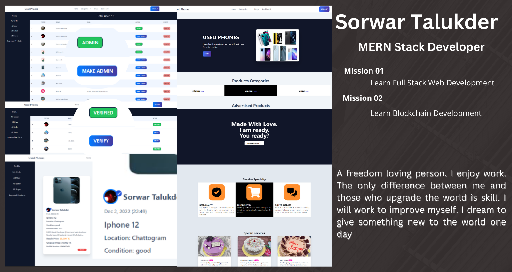

<!-- name -->
<h1 align="center">Hi 👋, I'm Sorwar Talukder</h1>
<!-- banner -->

## :mailbox: Reach me out

 

    <!-- linkedIN -->
    
    <!-- facebook -->
    
    <!-- twitter -->
    

 

<!-- skills -->
## :computer: Technologies that I know
 

 

## :chart_with_upwards_trend: Current Stats

 

  
   
  

<!-- about -->
<h1>About Me</h1>

MERN Stack Developer || Front-end web developer React.js based
I am Experienced with React.js, JavaScript, Express.js and MongoDB
 
 
I am a programmer and I am happy with this job. Because I like technology . The use of technology is increasing in the world. I want to make technology easy to reach people.
 
 
I am expert with JavaScript, React.js, CSS, Bootstrap, React Bootstrap, Tailwind, DaisyUI, HTML, Express.js, Firebase, MongoDB and I used many tools (Github, Netlify, Canva, Figma, React Icons, React Router, React Toast, React Query, React Photo View, React Hook Form,JWT, Context API etc).
 
 
I have worked on many of my projects. Every project is different and works Front-End, Backend and design done by me. I love productive work and try to concentrate as long as I work.
 
 
I am freedom loving person. I enjoy work. The only difference between me and those who upgrade the world is skill. I will work to improve myself. I dream of giving something new to the world one day.
 
 
📧 mdsorwar4039@gmail.com  
⌨️ 𝘛𝘦𝘹𝘵 / 𝘞𝘩𝘢𝘵𝘴𝘈𝘱𝘱: +880 1742554039  
📠ğ‘ªğ’‚ğ’ğ’ | ğ’ğ’ğ’ƒğ’Šğ’ğ’†: +880 1742554039  
<a href="https://sorwar-portfolio.web.app/">Developer Portfolio</a> 
 
<a href="https://drive.google.com/file/d/1_P_F6B3k6TGiXZJTBDMcrGuK4G_xPKko/view?usp=share_link">Download developer resume</a>

 

<!-- developer life Style -->
<h1>My life Style</h1>

<!-- 1 -->

<!-- 2 -->

<!-- 3 -->

<!-- 4 -->

<!-- 5 -->

<!-- 6 -->

<!-- 7 -->

<!-- 8 -->

<!-- 9 -->

<!-- 10 -->

<!-- 11 -->

<!-- 12 -->

<!-- 13 -->

<!-- 14 -->

<!-- 15 -->

<!-- 16 -->

 Last update: Dec 26, 2022
